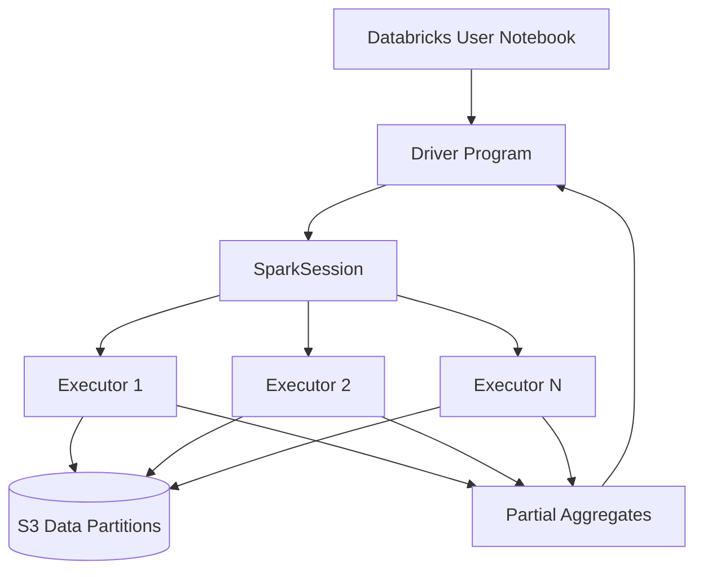
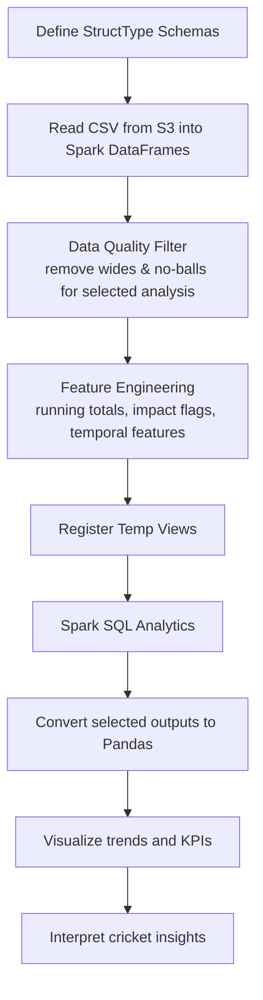

# IPL Data Engineering + Data Science + Data Analytics Project (Apache Spark on Databricks)


---

## 1. Project Summary

This project is a complete, end-to-end IPL analytics workflow designed to demonstrate practical capabilities across:

- Data Engineering: data ingestion, schema enforcement, cloud object storage integration, transformation pipelines.
- Data Science: feature engineering, analytical framing, domain-driven question formulation.
- Data Analytics: SQL-based exploration, KPI extraction, and business-focused visualization.

The pipeline is implemented using **Apache Spark (PySpark + Spark SQL)** on **Databricks**, with IPL source files stored on **Amazon S3**.

The notebook covers:

1. Spark fundamentals and setup.
2. Structured schema design for five IPL datasets.
3. Cloud-based ingestion from S3.
4. Transformations and feature enrichment.
5. Spark SQL analytical queries.
6. Python-based visual storytelling (Matplotlib + Seaborn).

---

## 2. Business + Technical Objective

The objective is to build a robust IPL analysis platform that can:

- Process match-level and ball-level cricket data at scale.
- Generate useful player/team/venue/toss insights.
- Demonstrate a production-style Spark workflow with explicit schemas and transformations.
- Showcase practical collaboration between data engineering and analytics stages.

This project intentionally mirrors real-world data projects where data is:

- Collected from public sources.
- Landed in cloud object storage.
- Processed using distributed compute.
- Queried for insights.
- Communicated visually.

---

## 3. Why Apache Spark for This Project?

Spark is used because IPL data analytics benefits from distributed processing patterns:

- In-memory compute for iterative analytics.
- Unified APIs for SQL + DataFrame transformations.
- Scalable joins and aggregations over event-level (ball-by-ball) records.
- Strong integration with Databricks notebooks and S3 cloud storage.

In this project, Spark is not just used for loading data; it is used for:

- Type-safe ingestion via explicit `StructType` schemas.
- Feature engineering using DataFrame operations and window functions.
- Complex analysis through Spark SQL temp views.
- Downstream conversion to Pandas only when plotting is needed.

---

## 4. High-Level Architecture

```mermaid
flowchart LR
		A[Public IPL Dataset<br/>data.world] --> B[Local Download]
		B --> C[AWS S3 Bucket<br/>s3://ipl-data-analysis-project]
		C --> D[Databricks Notebook]
		D --> E[PySpark DataFrames]
		E --> F[Transformations + Feature Engineering]
		F --> G[Temp Views for Spark SQL]
		G --> H[Analytical Queries]
		H --> I[Pandas Conversion for Plotting]
		I --> J[Matplotlib + Seaborn Visualizations]
		J --> K[Insights for Decision-Making]
```



### Spark Execution View (Conceptual)



---

## 5. Databricks + Spark Runtime Understanding

The notebook demonstrates practical understanding of Databricks execution behavior:

- Databricks provides managed Spark clusters and notebook runtime.
- `SparkSession` acts as the entry point for reading, transforming, and querying data.
- Reading CSVs from S3 is distributed across executors.
- SQL and DataFrame APIs can be used together by registering temporary views.
- Heavy transformations remain in Spark; only final aggregates are moved to Pandas for plotting.

This architecture balances distributed compute with Python visualization flexibility.

---

## 6. Tools, Libraries, and Platforms

- Platform: Databricks
- Processing Engine: Apache Spark
- Language: Python (PySpark + SQL)
- Storage: AWS S3
- Visualization: Matplotlib, Seaborn
- Data Source: data.world IPL dataset (till 2017)

---

## 7. Dataset Credit and Source Attribution

### Original Dataset (Credit)

- Source: https://data.world/raghu543/ipl-data-till-2017
- Credit: data.world contributor **raghu543** for publishing the IPL dataset.

### Cloud Storage Used in This Project

- S3 Bucket URI used in notebook: `s3://ipl-data-analysis-project`
- Files used:
	- `Ball_By_Ball.csv`
	- `Match.csv`
	- `Player.csv`
	- `Player_match.csv`
	- `Team.csv`

### Public Bucket Link (Credit)

- Bucket URI reference: `s3://ipl-data-analysis-project`
- Common HTTP endpoint format (if public access is enabled):
	- `https://examplelink.s3.amazonaws.com/`

If your exact public URL differs (region/static website endpoint/object-level URL), replace this section with your final shared link.

---

## 8. Data Acquisition and S3 Upload Process

### Step A: Download Data

1. Visit dataset page: https://data.world/raghu543/ipl-data-till-2017
2. Download the CSV files.
3. Keep file names unchanged for easier reproducibility.

### Step B: Upload to S3

```bash
aws s3 mb s3://ipl-data-analysis-project
aws s3 cp Ball_By_Ball.csv s3://ipl-data-analysis-project/
aws s3 cp Match.csv s3://ipl-data-analysis-project/
aws s3 cp Player.csv s3://ipl-data-analysis-project/
aws s3 cp Player_match.csv s3://ipl-data-analysis-project/
aws s3 cp Team.csv s3://ipl-data-analysis-project/
```

### Step C: (Optional) Public Sharing

```bash
aws s3api put-bucket-policy --bucket ipl-data-analysis-project --policy file://public-policy.json
```

Minimal public read policy (example):

```json
{
	"Version": "2012-10-17",
	"Statement": [
		{
			"Sid": "PublicReadGetObject",
			"Effect": "Allow",
			"Principal": "*",
			"Action": "s3:GetObject",
			"Resource": "arn:aws:s3:::ipl-data-analysis-project/*"
		}
	]
}
```

### Step D: Verify Objects

```bash
aws s3 ls s3://ipl-data-analysis-project/
```

---

## 9. End-to-End Pipeline Flow



---

## 10. Notebook Walkthrough (What Was Implemented)

### 10.1 Spark Session + Imports

- Initialized Spark context using `SparkSession.builder.appName("IPL Data Analysis").getOrCreate()`.
- Imported schema types (`StructType`, `StructField`, typed columns), SQL functions, and window utilities.

### 10.2 Explicit Schema Design

Custom schemas were defined for:

- `Ball_By_Ball.csv`
- `Match.csv`
- `Player.csv`
- `Player_match.csv`
- `Team.csv`

Why this matters:

- Prevents schema drift from `inferSchema` ambiguity.
- Improves reliability for joins and transformations.
- Makes the code closer to production-grade ETL design.

### 10.3 S3 Data Loading

Each file was loaded from S3 with schema and header options, for example:

- `spark.read.schema(ball_by_ball_schema).format("csv").option("header","true").load("s3://ipl-data-analysis-project/Ball_By_Ball.csv")`

### 10.4 Transformations and Feature Engineering

Applied major transformations include:

- Delivery-level filter for selected analyses:
	- exclude wides and no-balls.
- Match + innings run aggregates:
	- `sum(runs_scored)` and `avg(runs_scored)`.
- Running scoreboard feature using window functions:
	- cumulative `running_total_runs` over match/innings ordered by over.
- Impact-event classification:
	- boolean `high_impact_ball` if wicket or high runs.
- Match date derivations:
	- `year`, `month`, `day`.
- Match intensity labeling:
	- `win_margin_category` (High/Medium/Low).
- Toss influence feature:
	- `toss_match_winner` (Yes/No).
- Player metadata normalization:
	- lowercase + special character stripping for names.
	- missing value handling for batting/bowling attributes.
	- derived `batting_style`.
- Experience-related player-match features:
	- `veteran_status` and `years_since_debut`.

### 10.5 Spark SQL Layer

DataFrames were registered as temp views:

- `ball_by_ball`, `match`, `player`, `player_match`, `team`

Then SQL analytics were executed to answer business questions.

### 10.6 Visualization Layer

Spark query outputs were converted to Pandas and plotted with Matplotlib/Seaborn.

Visual topics implemented:

- Most economical bowlers in powerplay.
- Toss winner vs match outcome distribution.
- Average runs in winning matches (top batsmen).
- Average and highest scores by venue.
- Dismissal type frequencies.
- Team performance after winning toss.

---

## 11. Analytical Questions Solved

The notebook addresses multiple cricket analytics questions, including:

1. Which batsmen score most by season?
2. Which bowlers are most economical in powerplay overs?
3. How much does winning the toss impact winning the match?
4. Which players contribute highest average runs in winning matches?
5. Which venues produce higher average scores?
6. Which dismissal types are most frequent?
7. Which teams capitalize best after winning toss?

This demonstrates complete analytical lifecycle from query design to visual interpretation.

---

## 12. Raw Data Dictionary (Before Transformation)

This section preserves the original dataset structure used in this project.

### 12.1 Ball_By_Ball.csv

| Column Name | Type | Description |
|---|---|---|
| match_id | integer | Unique ID for an IPL Match |
| over_id | integer | Number which uniquely identifies an over in an innings |
| ball_id | integer | Number which uniquely identifies a ball in an over |
| innings_no | integer | Innings number |
| team_batting | string | Batting team |
| team_bowling | string | Bowling team |
| striker_batting_position | integer | Batting order position |
| extra_type | string | Type of extra |
| runs_scored | integer | Runs from the bat |
| extra_runs | integer | Extra runs |
| wides | integer | Wide deliveries count |
| legbyes | integer | Leg-byes |
| byes | integer | Byes |
| noballs | integer | No-balls |
| penalty | integer | Penalty runs |
| bowler_extras | integer | Extras conceded by bowler |
| out_type | string | Dismissal type |
| caught | boolean | Caught flag |
| bowled | boolean | Bowled flag |
| run_out | boolean | Run-out flag |
| lbw | boolean | LBW flag |
| retired_hurt | boolean | Retired-hurt flag |
| stumped | boolean | Stumped flag |
| caught_and_bowled | boolean | Caught-and-bowled flag |
| hit_wicket | boolean | Hit-wicket flag |
| obstructingfeild | boolean | Obstructing-field flag |
| bowler_wicket | boolean | Bowler credited wicket flag |
| match_date | date | Match date |
| season | integer | IPL season |
| striker | integer | Striker player id |
| non_striker | integer | Non-striker player id |
| bowler | integer | Bowler player id |
| player_out | integer | Dismissed player id |
| fielders | integer | Fielder player id |
| striker_match_sk | integer | Surrogate key |
| strikersk | integer | Surrogate key |
| nonstriker_match_sk | integer | Surrogate key |
| nonstriker_sk | integer | Surrogate key |
| fielder_match_sk | integer | Surrogate key |
| fielder_sk | integer | Surrogate key |
| bowler_match_sk | integer | Surrogate key |
| bowler_sk | integer | Surrogate key |
| playerout_match_sk | integer | Surrogate key |
| battingteam_sk | integer | Batting team key |
| bowlingteam_sk | integer | Bowling team key |
| keeper_catch | boolean | Keeper catch flag |
| player_out_sk | integer | Player out key |
| matchdatesk | date | Match date surrogate |

### 12.2 Match.csv

| Column Name | Type | Description |
|---|---|---|
| match_sk | integer | Match surrogate key |
| match_id | integer | Match id |
| team1 | string | Team 1 |
| team2 | string | Team 2 |
| match_date | date | Match date |
| season_year | year | Season year |
| venue_name | string | Venue |
| city_name | string | City |
| country_name | string | Country |
| toss_winner | string | Toss winner |
| match_winner | string | Match winner |
| toss_name | string | Toss decision |
| win_type | string | Win type |
| outcome_type | string | Outcome type |
| manofmach | string | Man of the match |
| win_margin | integer | Win margin |
| country_id | integer | Country id |

### 12.3 Player.csv

| Column Name | Type | Description |
|---|---|---|
| player_sk | integer | Player surrogate key |
| player_id | integer | Player id |
| player_name | string | Player name |
| dob | date | Date of birth |
| batting_hand | string | Batting hand |
| bowling_skill | string | Bowling skill |
| country_name | string | Country |

### 12.4 Player_match.csv

| Column Name | Type | Description |
|---|---|---|
| player_match_sk | integer | Player-match surrogate key |
| playermatch_key | decimal | Composite key |
| match_id | integer | Match id |
| player_id | integer | Player id |
| player_name | string | Player name |
| dob | date | Date of birth |
| batting_hand | string | Batting hand |
| bowling_skill | string | Bowling skill |
| country_name | string | Country |
| role_desc | string | Role description |
| player_team | string | Player team |
| opposit_team | string | Opposite team |
| season_year | year | Season year |
| is_manofthematch | boolean | Man of match flag |
| age_as_on_match | integer | Age during match |
| isplayers_team_won | boolean | Team won flag |
| batting_status | string | Batting status |
| bowling_status | string | Bowling status |
| player_captain | string | Captain flag/info |
| opposit_captain | string | Opponent captain flag/info |
| player_keeper | string | Keeper flag/info |
| opposit_keeper | string | Opponent keeper flag/info |

### 12.5 Team.csv

| Column Name | Type | Description |
|---|---|---|
| team_sk | integer | Team surrogate key |
| team_id | integer | Team id |
| team_name | string | Team name |

---

## 13. Transformed Data Dictionary (After Feature Engineering)

### 13.1 ball_by_ball_df (transformed)

New/Changed aspects:

- Filter applied: rows restricted to deliveries where `wides = 0` and `noballs = 0` for selected analyses.
- Added `running_total_runs` (numeric):
	- cumulative sum of `runs_scored` partitioned by `match_id`, `innings_no`, ordered by `over_id`.
- Added `high_impact_ball` (boolean):
	- `True` when `(runs_scored + extra_runs > 6) OR bowler_wicket = True`, else `False`.

### 13.2 match_df (transformed)

Added columns:

- `year` (integer): extracted from `match_date`.
- `month` (integer): extracted from `match_date`.
- `day` (integer): extracted from `match_date`.
- `win_margin_category` (string):
	- High: `win_margin >= 100`
	- Medium: `50 <= win_margin < 100`
	- Low: otherwise.
- `toss_match_winner` (string):
	- Yes when toss winner equals match winner, otherwise No.

### 13.3 player_df (transformed)

Transformations:

- `player_name` normalized to lowercase and non-alphanumeric characters removed.
- Missing values in `batting_hand` and `bowling_skill` filled as `unknown`.
- Added `batting_style` (string): Left-Handed vs Right-Handed derived from `batting_hand`.

### 13.4 player_match_df (transformed)

Added columns:

- `veteran_status` (string): Veteran when `age_as_on_match >= 35`, else Non-Veteran.
- `years_since_debut` (integer): computed as `year(current_date()) - season_year`.

### 13.5 SQL temp views

Views created:

- `ball_by_ball`
- `match`
- `player`
- `player_match`
- `team`

---

## 14. SQL Analytics Implemented

The notebook includes these analytical SQL workloads:

1. `top_scoring_batsmen_per_season`
	 - Aggregates runs by player and season.
2. `economical_bowlers_powerplay`
	 - Computes average runs per ball in overs 1-6 and counts wickets.
3. `toss_impact_individual_matches`
	 - Labels matches as Won/Lost after toss by comparing toss and match winner.
4. `average_runs_in_wins`
	 - Player batting averages restricted to matches where player team won.
5. `scores_by_venue`
	 - Venue-level average and peak match scores.
6. `dismissal_types`
	 - Frequency distribution of valid dismissal modes.
7. `team_toss_win_performance`
	 - Team-level count of wins after winning toss.

These analyses combine event-level records with dimensional context from match/player tables.

---

## 15. Visualization Layer

The notebook then translates selected Spark outputs into business-readable visuals:

- Bar chart: Top 10 economical bowlers in powerplay.
- Count plot: toss winner vs match outcome.
- Bar chart: top batsmen average runs in winning matches.
- Horizontal bar chart: venue-wise scoring profile.
- Bar chart: dismissal frequency analysis.
- Bar chart: team performance after toss wins.

This separation (Spark for compute, Python plotting for presentation) is a strong production pattern.

---

## 16. Data Engineer, Data Scientist, and Data Analyst Concepts Covered

### Data Engineering

- Cloud object storage integration using S3.
- Explicit schema contracts.
- Data cleansing and null handling.
- Scalable transformation logic.
- Reusable temp views for downstream consumers.

### Indirect Data Engineering Concepts Applied in This Project

- Data lake ingestion pattern:
	- Public dataset downloaded and landed into S3 before processing, following a common raw zone ingestion style.
- Schema governance:
	- Explicit `StructType` definitions prevent accidental type drift that often happens with auto inference.
- Data quality gating:
	- Delivery-level filtering (`wides = 0`, `noballs = 0`) acts like a rule-based quality step before analysis.
- Feature-ready modeling:
	- Engineered columns (`running_total_runs`, `high_impact_ball`, `win_margin_category`) prepare data for downstream analytics consumers.
- Compute optimization mindset:
	- Spark handles distributed joins/aggregations first; only compact result sets are converted to Pandas.
- Semantic layer creation:
	- Temporary views (`ball_by_ball`, `match`, `player`, `player_match`, `team`) simulate a reusable SQL serving layer.

### Data Science

- Domain-specific feature engineering.
- Categorical signal derivation (win margin bands, toss impact, veteran status).
- Event importance tagging (`high_impact_ball`).

### Data Analytics

- KPI query development in Spark SQL.
- Team/player/venue/toss performance breakdowns.
- Visual narrative design for stakeholder communication.

### Indirect Data Analyst Concepts Applied in This Project

- Problem framing into measurable questions:
	- The notebook converts broad goals into clear analytics prompts (top scorers, toss impact, venue scoring, dismissal trends).
- Metric design and decomposition:
	- Metrics are broken into interpretable units such as runs per season, runs per ball, average runs in wins, and frequency counts.
- Segment-based analysis:
	- Insights are segmented by season, player, team, venue, innings, and powerplay phase.
- Comparative analysis logic:
	- Toss winner vs match winner and team toss-win conversion are direct examples of comparison-driven analytics.
- Insight communication:
	- Bar plots and count plots are chosen to make ranking and distribution insights easy to interpret for non-technical stakeholders.
- Decision-support orientation:
	- Outputs can be used by team analysts/coaches for strategy review (venue behavior, toss influence, bowling economy patterns).

---

## 17. Results

This section summarizes the key outcomes produced from the Spark SQL analytics and visualization layer.

### 17.1 Player Performance Outcomes

- Seasonal run-scoring trends were generated for batsmen across IPL seasons.
- Top contributors were identified by aggregating `runs_scored` by player and season.
- Average batting contribution in winning matches was measured to separate impact players from volume scorers.

### 17.2 Bowling and Match Dynamics Outcomes

- Powerplay economy patterns were calculated using average runs per ball in overs 1-6.
- Wicket involvement was combined with economy metrics to evaluate overall bowling effectiveness in early overs.
- Dismissal-mode frequencies were extracted to understand dominant wicket patterns.

### 17.3 Toss and Team Strategy Outcomes

- Match-level toss impact was evaluated by comparing toss winners vs match winners.
- Team-level conversion after winning toss was quantified to identify strategic efficiency.

### 17.4 Venue and Scoring Outcomes

- Venue-wise average score and highest observed score were computed.
- High-scoring and low-scoring venues were distinguishable through venue-level score distributions.

### 17.5 Data Engineering and Modeling Outcomes

- Explicit schemas improved data reliability and repeatability during ingestion.
- Engineered columns (`running_total_runs`, `high_impact_ball`, `win_margin_category`, `batting_style`, `veteran_status`) enriched analytical depth.
- Spark SQL temp views created a reusable semantic layer for iterative analysis.

### 17.6 Visualization Outcomes

- Query outputs were transformed into clear decision-oriented visuals.
- Ranking and distribution charts enabled easier interpretation for non-technical audiences.
- The notebook achieved an end-to-end flow from raw ingestion to insight communication.

---

## 18. How to Run This Project (Reproducibility)

1. Upload all CSV files to your S3 bucket.
2. Open Databricks notebook environment.
3. Ensure cluster has PySpark + plotting libraries.
4. Update S3 paths if bucket name differs.
5. Execute notebook top-to-bottom.
6. Review DataFrame previews, SQL output tables, and final charts.

---

## 19. Closing Note

This project is intentionally designed as an all-in-one Spark portfolio case study demonstrating:

- platform understanding (Databricks + Spark architecture),
- engineering rigor (typed schema + transformation pipeline),
- analytical depth (SQL insights across multiple IPL dimensions), and
- communication maturity (visual analytics and documented flow).

---

## 20. Final Credit

- Dataset credit: https://data.world/raghu543/ipl-data-till-2017
- AWS S3 reference used in project: s3://ipl-data-analysis-project
